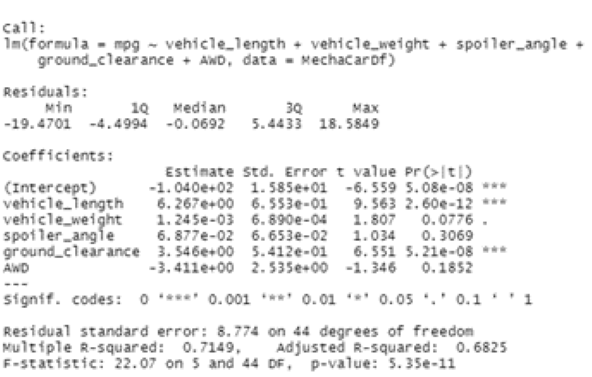
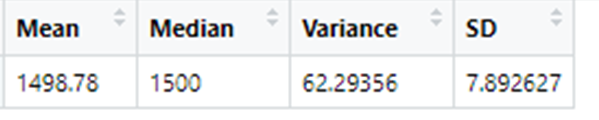
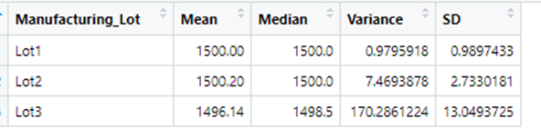
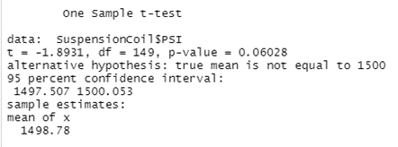
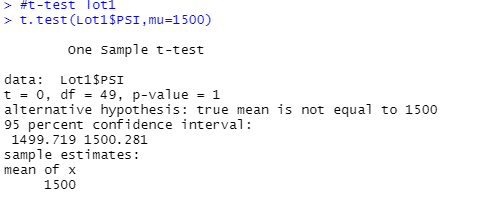
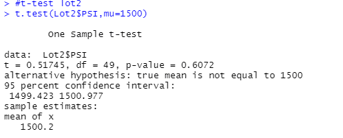
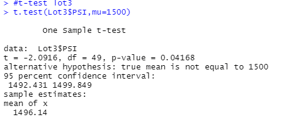

# MechaCar_Statistical_Analysis

## Linear Regression to Predict MPG

### Statistical Analysis: 
1. Among all five variables fitted in linear regression model, vehicle_length and ground_clearance are statistically significant due to their non-random variation in the model. Vehicle_length with P-value of 2.6e-12 is much smaller than the assumed 0.05 significant level. Likewise, the ground clearance with P-value of 5.21e-08. AWD with P-value of 0.1852, vehicle_weight with P-value of 0.0776 and spoiler_angel with P-value of 0.3069 are all higher than the 0.05 significant level which means their variance are likely due to random occurrences in the dataset of study.

2. This regression model produced the P-value of 5.35e-11 which is significantly smaller than the assumed significance level of 0.05. Therefore, we can conclude that there is sufficient evidence to reject our null hypothesis and the slope of this linear model is not zero.

3. This regression model produced the r-squared value of 0.7149, which indicates that about 71% of the variability of our dependent variable (MPG -mile per gallon) is explained using this linear model. In a linear regression model, the higher the correlation is between two variables, the more that one variable can explain/predict the value of the other. Therefore, we can conclude that this model does predict the MPG effectively.If we remove the less impactful independent variables (vehicle weight, spoiler angle, and All Wheel Drive), the predictability does decrease, but not drastically: the r-squared value falls from 0.7149 to 0.674.

## Summary Statistics on Suspension Coils
### Total Summary:

### Lot Summary:

### Statistical Analysis:
The design specifications for the MechaCar suspension coils dictate that the variance of the suspension coils must not exceed 100 pounds per square inch. In total the variance of 62.29356 is well within the limits of 100 PSI. However, the variance investigated at the lot level indicates that Lot3 with variance of 170.29 is considerably over the limits of 100 PSI. Meanwhile, the variance in Lot1 (0.98) and Lot2 (7.47) are both sitting at the very low level within the limits of 100 SPI. 

## T-Tests on Suspension Coils

### T-test entire dataset:

Conducting t-test on entire dataset, the P-value of 0.06 is derived which is slightly over the significance level of 0.05. We can infer that we do not have sufficient evidence to reject the null hypothesis, and we would state that the two means are statistically similar to the presumed population mean of 1500. 

### T-test Lot 1:

T-Test Lot1:
Conducting t-test on subset of dataset for Lot1, the P-value of 1 is derived. We can clearly infer that we have no evidence to reject the null hypothesis, and we would state that the two means are statistically similar to the presumed population mean of 1500. 

### T-test Lot 2:

Conducting t-test on subset of dataset for Lot1, the P-value of 0.60 is derived which is well over the significance level of 0.05. We can infer that we do not have sufficient evidence to reject the null hypothesis, and we would state that the two means are statistically similar to the presumed population mean of 1500. 

### T-test Lot 3:

Conducting t-test on subset of dataset for Lot3, the P-value of 0.04 is derived which is lower than the significance level of 0.05. We can infer that we do have sufficient evidence to reject the null hypothesis, and we accept the alternative hypothesis and would state that the two means are statistically different to the presumed population mean of 1500.

### T-test statistical infrence:

The samples of Lot1 and Lot 2 are not statistically different from the population dataset. However, Lot3 has significant statistical difference from the population. Therefore, the manufacturer need to inspect the performance of the Lot3 cars to understand the reasons behind this difference.

## Study Design: MechaCar vs Competition

### Metrics
Collecting data for comparable models across all major manufacturers for past 3 years for the following metrics:

* Dependent Variables:
1. Sales Quantity per Fiscal Cycle

* Independent variable
1. Defective Units/Recall Rates
2. Sale Price
3. Customer Satisfaction
4. Fuel efficiency
5. Maintenance Cost

### Hypothesis:
* Null Hypothesis (Ho): MechaCar sales per fiscal year is based on the level of the key factors (independent variable) in consumer market
* Alternative Hypothesis (Ha): MechaCar sales per fiscal year is NOT based on the level of the key factors (independent variable) in consumer market

### Statistical Tests
A multiple linear regression model predicting the key factors with correlation with the quantity sales. Followed by the comparative analysis of MechaCar and its competitors in the market.

### Data Collection:
The data features selected for this study can be collected online through car dealership reviews and manufacturers public statements for the fiscal performance

